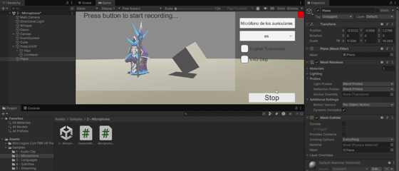

# Interfaces-Inteligentes-Practica-10

En esta práctica se experimenta con Whisper Tiny para Unity de forma local

---

### 1. Comandos mediante reconocimiento de voz

Utilizar la escena de prueba de micrófono para reconocer la voz y comandos específicos en base a los cuales se realizan ciertas acciones

Para este ejercicio se ha modificado el script de ejemplo de MicrophoneDemo.cs para que, tras detectar la voz e interpretarla en una cadena de texto, se reconozcan dos expresiones regulares para ejecutar comandos con respecto a los objetos de la escena (Cubo  Guerrero):
- Se reconoce la palabra "Cambia" o "Change". Cuando se reconoce en una cadena de texto, el cubo cambia a un color aleatorio.
- Se reconoce la palabra "Avanza" o "Forward". Cuando esto ocurre, se lanza un evento para el cual el guerrero en la escena se ha suscrito y está en escucha. Cuando ese evento ocurre (cuando se reconoce "Avanza" o "Forward"), el guerrero se mueve hacia delante con una velocidad constante.
  
**Scripts:**  
- [MicrophoneDemo.cs](Scripts/MicrophoneDemo.cs)  
- [HumanoidResponse1.cs](Scripts/HumanoidResponse1.cs)

APK creada: [Whisper.apk](apk/whisper.apk)
